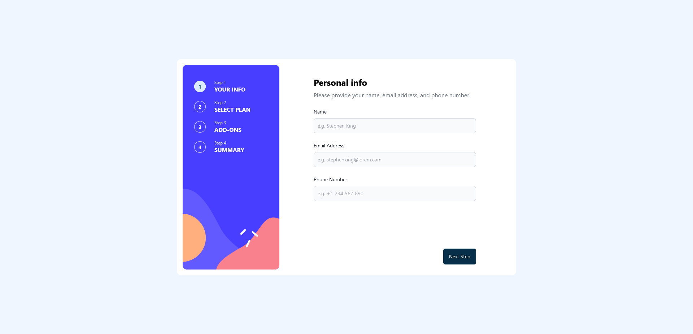

# Frontend Mentor - Dictionary web app solution

This is a solution to the [Multi-step form](https://www.frontendmentor.io/challenges/multistep-form-YVAnSdqQBJ). Frontend Mentor challenges help you improve your coding skills by building realistic projects.

## Table of contents

- [Overview](#overview)
  - [The challenge](#the-challenge)
  - [Screenshot](#screenshot)
  - [Links](#links)
- [My process](#my-process)
  - [Built with](#built-with)
- [Author](#author)

## Overview

### The challenge

Users should be able to:

- Complete each step of the sequence
- Go back to a previous step to update their selections
- See a summary of their selections on the final step and confirm their order
- View the optimal layout for the interface depending on their device's screen size
- See hover and focus states for all interactive elements on the page
- Receive form validation messages if:
- A field has been missed
- The email address is not formatted correctly
- A step is submitted, but no selection has been made

### Screenshot

### Links

- Solution URL: [GitHub](https://github.com/waldekglaz/fem-form-component)
- Live Site URL: [Live preview](https://multi-step-form-wg.netlify.app/)

## My process

### Built with

- [React](https://reactjs.org/) - JS library
- [TypeScript](https://www.typescriptlang.org/) - superset of JavaScript
- [Tailwind CSS](https://tailwindcss.com/) - For styles
- [React Router v6](https://reactrouter.com/en/main) - For client side routing
- [Redux Toolkit](https://redux-toolkit.js.org/) - For state management

## Author

- Frontend Mentor - [@waldekglaz](https://www.frontendmentor.io/profile/waldekglaz)
